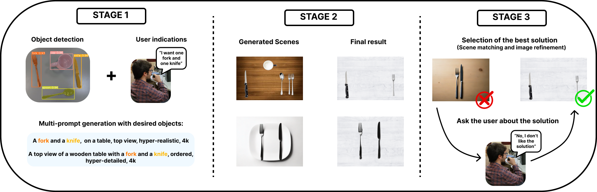

# **User-guided framework for scene generation using diffusion models**
<p align="center">
  
</p>

This project presents a user-guided framework for scene generation using diffusion models. The proposed framework comprises a perception stage, followed by a solution generation, and a final-stage selection algorithm. With this architecture the robot reach a reasoning able to imagine new situations with and without context, depending on the input information given. To achieve the best relation between performance and execution time, different diffusion models were systematically evaluated under a zero-shot configuration. Also, we make tests to prove the accuracy of the method and how useful users find this application. These were made for various scenes and different applications like rearrangement objects, setting the table for dinner or ordering a messy desktop.


The proposed framework is composed by in 3 diferent stages:
- *Stage 1* : detects the elements of the environment using Yolov8 and the user indications with SpeechRecognition.
- *Stage 2* : generate new scenes using StableDiffusion with the generated prompts.
- *Stage 3* : performs a human-in-the-loop process to get not only the best result, but also the one that pleases the user.

# Installation
To be used on your device, follow the installation steps below.

**Requierements:**
- Python 3.9 or higher
- [Cuda](https://developer.nvidia.com/cuda-downloads) 11.8 or higher
- [Pytorch](https://pytorch.org/get-started/locally/) 2.1 or higher


> **Note**: Tested under Ubuntu 20.04 with Python 3.9.18, Cuda 11.8 and Pytorch 2.1.0

## Install miniconda (highly-recommended)
It is highly recommended to install all the dependencies on a new virtual environment. For more information check the conda documentation for [installation](https://conda.io/projects/conda/en/latest/user-guide/install/index.html) and [environment management](https://conda.io/projects/conda/en/latest/user-guide/tasks/manage-environments.html). For creating the environment use the following commands on the terminal.

```bash
conda create -n User-guided-scene-with-StableDiffusion python=3.9.18 
conda activate User-guided-scene-with-StableDiffusion
```

## Install from source
Firstly, clone the repository in your system.
```bash
git clone https://github.com/albmendez/User-guided-scene-with-StableDiffusion
```
### *Necessary external libraries*
Follow the instructions in [Yolov8](https://github.com/ultralytics/ultralytics).

Follow the instructions in [StableDiffusion](https://github.com/Stability-AI/generative-models)


Then, enter the directory and install the required dependencies
```bash
cd User-guided-scene-with-StableDiffusion
pip install -r requirements.txt
```
> **Note**: This framework requires the use of a Realsense D435 (or any other Realsense model)

# Usage
#### *Stage 1. Scene Recognition*:
The scene recognition is the initial stage for the scene generation, therefore it is essential to locate the objects and understand the user requirements to have a correct performance. Also, as this scene generation is intended for a posterior manipulation task, the grasping point and orientation of the detected objects must be accurate. To this end, our algorithm starts performing an instance segmentation of the environment and the speech recognition of user requests. Followed by the extraction of the Oriented Bounding Box (OBB) and the direction of the object to refine the orientation, where necessary. 

#### *Stage 2. Scene Generation*:
In this stage the algorithm aims to mimic human abilities generating new scenes that are consistent with the current scene and user requirements. Creating a picture of the finished scenario where the elements are placed in a logical and considerate manner. In order to do this, we use a Latent Diffusion Model called Stable Diffusion XL, as this model is trained using a huge collection of photos and descriptions made by humans.

#### *Stage 3. Solution Selection*:
Even though Stable Diffusion creates scenes in an ordered and detailed manner, it occasionally produces extra elements or undesired duplicate items that weren't specifically requested by the user and do not fit the desired scene. For this reason, in this stage, an algorithm for selecting the best images has been developed in order to choose that most closely resembles and adjusts to the prompt that the algorithm specifies. There are two possibilities: finding an exact solution, that is, the one with the exact same number of elements, or, in case none of the generated scenes by Stable Diffusion yields an exact solution, the algorithm proceeds to find images with the least amount of difference.

<p align="center">
  
</p>

### **Algorithm execution**
To launch the algorithm, the Realsense camera and a microphone must be connected. First, the scene recognition stage is launched to perform an instance segmentation and an estimation of the objects pose, in combination with a speech recognition to get the information of the actual scene and the desired scene. With this information the algorithm continues to the second stage, generating different prompts and generates the new scenes using a diffusion model. Between these new scenes the most accurate solution is provided as a solution to the user, who decides if it is good enough or requires another scene. 

To execute all the code run:

``` bash
python Controlller.py
```

# Citation
If you use this code, please quote our works :blush:

At the moment, pending of acceptance in a conference. :seedling:
